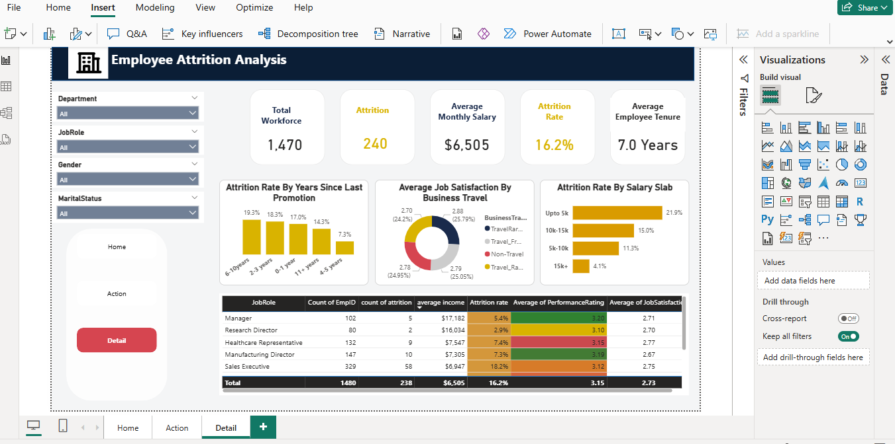
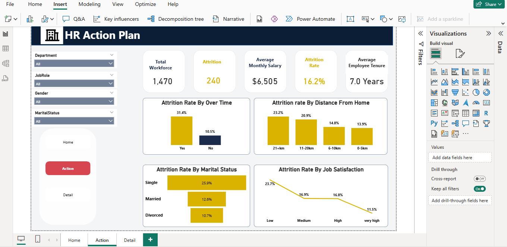

# HR Analytics Dashboard

This HR Analytics Dashboard was developed using Microsoft Power BI to analyze employee data and identify key factors influencing employee attrition. The dashboard provides HR professionals and business managers with actionable insights to improve employee retention and workforce performance.

---

## Project Objectives

- Monitor employee attrition trends.
- Analyze workforce demographics.
- Evaluate employee satisfaction.
- Identify departments with high attrition.
- Support data-driven HR decision-making.

---

## Dataset Description

The dataset contains employee information including:

- Age
- Gender
- Department
- Job Role
- Monthly Income
- Education
- Job Satisfaction
- Overtime
- Years at Company
- Years Since Last Promotion
- Performance Rating
- Attrition

---

## Dashboard Preview

---

## Dashboard Pages

### Home Dashboard
Provides an overview of the organization's workforce through key HR metrics, including total employees, attrition rate, average age, and employee distribution across departments.

### Details Dashboard
Offers detailed insights into employee demographics, salary distribution, education level, job roles, gender, and other workforce characteristics.

### Action Dashboard
Highlights the key drivers of employee attrition by analyzing factors such as overtime, years since last promotion, job satisfaction, and work-life balance. This page helps HR managers identify areas that require immediate attention to improve employee retention.

---

## Key Insights

- Employees working overtime showed a higher likelihood of attrition.
- Certain departments experienced higher employee turnover than others.
- Job satisfaction had a significant impact on employee retention.
- Employees with fewer years since their last promotion were more likely to leave.
- Workforce demographics revealed patterns that can support better HR planning.

  ---

  
  ## Business Impact

This dashboard enables HR professionals and business leaders to:
- Monitor employee attrition trends.
- Identify factors affecting employee retention.
- Support strategic workforce planning.
- Improve employee engagement and satisfaction.
- Make informed, data-driven HR decisions.
  ---

  
## Key KPIs

- Total Employees
- Attrition Count
- Attrition Rate
- Average Age
- Average Monthly Income
- Average Years at Company

---

## Tools Used

- Microsoft Power BI
- Microsoft Excel
- Power Query
- DAX

---

## Skills Demonstrated

- Data Cleaning
- Data Visualization
- Dashboard Design
- HR Analytics
- Business Intelligence
- DAX
- Power Query

---

## Dataset Source

This project uses the IBM HR Analytics Employee Attrition & Performance dataset obtained from Kaggle.
**Source:** https://www.kaggle.com/datasets/pavansubhasht/ibm-hr-analytics-attrition-dataset
**Note:** The dataset was used for educational and portfolio purposes only.

---

## Conclusion

This HR Analytics Dashboard demonstrates how Power BI can transform employee data into actionable insights. By analyzing workforce trends and attrition drivers, the dashboard supports data-driven HR decisions that can improve employee retention and organizational performance.

---

## Author

       

Boladale Hajarat Toyosi
Data Analyst | Statistician | Power BI Developer

Email: toyobaby41@gmail.com
LinkedIn: https://www.linkedin.com/in/boladale-hajarat-toyosi-2bb4a2271?utm_source=share_via&utm_content=profile&utm_medium=member_android
GitHub
